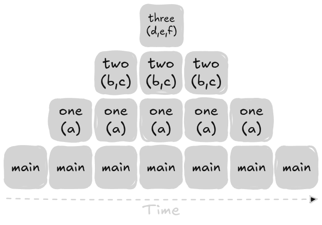
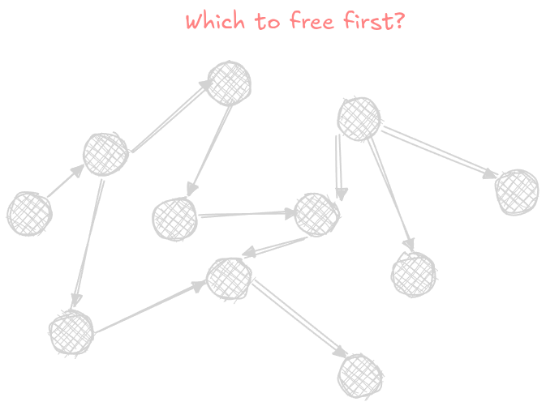

لية بنستعمل Python؟ JavaScript؟ Java؟ Dart؟ اي طالب CS في سنة اولى ممكن يقولك ان اللغات دي بطيئة بالنسبة للغات تانية زي C. لو احنا عايزين الـSoftware بتاعنا يبقى اسرع مايمكن, لية بنستعمل اللغات دي لما ممكن نكون بنستعمل C++ مثلاً في كل حاجة؟

الأجابة بسيطة: Ease of use. اللغات دي سهلة جداً فالاستعمال, الـSyntax بتاعها بسيط, بتقرأ زي الـEnglish, غالباً بتبقى Portable, ومن اهم الصفات انها Garbage Collected.

Garbage Collected يعني الـCoder مش بيفكر فالـMemory. بينساها من دماغه (Ironically). لو كتبت برنامج بيستعمل 100 كيلوبايت, انا مش محتاج اعمل للـ100 كيلوبايت دي `free`, لأني عارف ان الـRuntime بتاعت اللغة بتاعتي هتنقذني و هتحرر الـMemory اللي طلبتها دي في وقت ما.

الوضع مكنش كدا على طول, معظم الـCoders زمان كانوا بيستعملوا Manual Memory Management, بيقولوا للكمبيوتر: انا هعمل Object. الـObject دي كلها على بعضها 100 كيلوبايت. الكمبيوتر مهمته الوحيدة انه يرجعلك الـMemory دي عشان تحط عليها الـData اللي انت محتاجها. مش مهمته انه يحرر الـMemory دي في وقت اخر. دي مهمتك انت.

هفترض في الـArticle دي انك عندك فكرة عن الـHeap, الـStack, و اية `malloc` و `free`.

## Stack Based Allocations

وانت بتتعلم برمجة لأول مرة في حياتك بتعرف ان في طريقتين انك تعمل ميموري. على الـStack او على الـHeap. غالباً اتعلمت ان الـStack اسرع عشان الميموري بتبقى ورا بعض, والـHeap ابطىء عشان الميموري بتبقى مبعثرة. وانك بتستعمل الـHeap لما متكونش عارف الـObject اللي انت عايزها هتبقى قد اية, فانت بتستعمل Dynamic Memory. الكلام دا مش دقيق اوي, انت ممكن بسهولة تستعمل الـStack عشان تعمل Dynamic Memory, بطريقة هنشوفها بعدين.

تخيل الكود اللي تحت دا:

```py
def three():
    e = 3
    f = 3
    g = 3


def two():
    b = 2
    c = 2


def one():
    a = 1
    two()

def main():
    one()

if __name__ == "__main__":
    main()
```

لو جينا نبص على الـBytecode بتاع Python دا على Godbolt, وركزنا على `three` هنلاقي دا:

```asm
Disassembly of <code object three at 0x5676616f8980, file "example.py", line 1>:
  1           RESUME                   0

  2           LOAD_SMALL_INT           3
              STORE_FAST               0 (e)

  3           LOAD_SMALL_INT           3
              STORE_FAST               1 (f)

  4           LOAD_SMALL_INT           3
              STORE_FAST               2 (g)
              LOAD_CONST               1 (None)
              RETURN_VALUE
```

لاحظ ان في 3 Store (Allocate) بس مفيش اي Deallocate. عشان الـStack Frame كله بيتشال مرة واحدة, فا دا يعتبر الـDeallocate بتاعك.


الـVariables اللي احنا بنعملها بتتشال كلها مرة واحدة, عشان الـStack Frame كله بيتشال.

سؤال بقا, احنا لية منستعملش الـStack لكل حاجة؟ الـStack تعتبر حاجة Efficient جداً. بتعمل Allocation واحدة لكل Object, و Deallocation لكل الـObjects لما الـLifetime بتاعت الـStack Frame تخلص.

الفكرة كلها مش اننا عايزين Dynamic Memory. احنا لو عايزين Dynamic Memory, دي حاجة ممكنة على الـStack بـAPI اسمه [`alloca`](https://man7.org/linux/man-pages/man3/alloca.3.html) موجود في الـStdlib بتاعت C. الفكرة ان احنا عايزين الـMemory بتاعتنا تطلع براالـStack Frame. مش عايزين الـMemory اللي احنا بنعمله تروح بعد مالـFunction Call تخلص.

## Heap Based Allocations

على الجانب الأخر عندنا الـHeap. الطريقة العادية انك تعمل Allocation على الـHeap هي انك تستعمل الـC API اللي اسمه `malloc` و `free`.

الـAPI بتاعهم مش صعب يتفهم, والهدف من الـArticle دي مش انك تتعلم `malloc` و `free`, لكن انك تتعلم Advanced Techniques للـMemory Allocation.

الفكرة بتاعت `malloc` و `free` بسيطة. عايز ميموري؟ اطلب بـ`malloc`. معنتش عايزها؟ حررها بـ`free`. لو انتظمت على الشكل دا, البرنامج بتاعك مستحيل يبقى فيه Memory Leak.

الـParadigm دا حلو. لكل `malloc`, لازم يبقى في `free` تصاحبها. لكن، في الواقع، الموضوع مش سهل بالبساطة دي دايماً.

### Manual Memory Management: Problems

اصدقائنا بتوع الـCybersecurity عارفين ان جزء كبير من مجالهم موجود عشان يلاقي كود بيستعمل `malloc` و `free` بطريقة غلط. زي انك تعمل `free` مرتين (Double Free), وهو ممكن يخليك تكتب على Memory اتحجزت لحاجة تانية خالص من غير ما تاخد بالك. او انك تـ`malloc` لـBuffer صغير عن حجم الـData اللي هتحطها فيه, فتكتب برا حدود الـBuffer وتبوظ Memory جنبه. فانت لازم تاخد بالك كويس وانت بتستعمل الـAPI دا.

رغم كدا، كل لسه محتاج يدور على مساحة مناسبة، ويحدث الـMetadata الداخلية بتاعته، ويتعامل مع مشاكل زي الـFragmentation. يعني حتى لو مفيش Syscall، فهو مش Operation ببلاش.

ان الـOperation ممكن تكون Expensive شوية مش الحاجة الوحيدة السيئة في الـParadigm دا. لو انت عندك Graph كله Objects, انك تعرف انهي Node تعمله `free` الأول ممكن يبقى صعب, بالذات لو الـGraph Cyclic.



حتى لو استعملت الـAPI صح 100%، لسه فيه تكلفة بتدفعها. الـ ممكن يضطر يطلب Memory جديدة من الـOS، ودا بيكون مكلف لأنه غالباً بيتضمن System Call. لكن معظم الـAllocators الحديثة مبتعملش Syscall لكل `malloc`. بدل كدا، بتطلب Chunk كبيرة من الـMemory مرة واحدة، وبعدها تقسمها بنفسها على الـAllocations الصغيرة اللي برنامجك بيطلبها.

### 300,00 Rats

تخيل انك بتعمل لعبة. لعبة زي مثلاً A Plague Tale: Requiem. [بيكون موجود اكتر من 300,000 فار عالـScreen](https://en.wikipedia.org/wiki/A_Plague_Tale:_Requiem#:~:text=The%20release%20of%20a%20new%20generation%20of%20consoles%20allowed%20the%20game%20to%20render%20more%20than%20300%2C000%20rats%20at%20once.). بعيداً عن صعوبة الـRendering اصلاً على الـGPU, الـCPU محتاج يـTrack الـObject نفسها عشان الـLogic بتاع الفار نفسه. هو بالتأكيد ان مش كل فار Object لوحده, بيحصل Merging لكن نفترض ان في اللعبة الخيالية بتاعتنا دي ان احنا مضطرين نخلي كل فار Object لوحده.

هنعمل Creation للـObjects دي ازاي؟ احنا لو عملنا 300,000 Allocation مرة واحدة حرفياً مش هنخلص. تخيل انك عندك Ability فاللعبة برضو انك تقتل كل الـEnemies على الـScreen. لما تقتل الـEnemies بيختفوا. هل هنعمل 300,000 `free`؟

الحل الانسب عندنا, ان مادام الـEnemies دي بيتعملها Spawn مرة واحدة, وبيختفوا مرة واحدة برضو, ان احنا نعمل Allocation واحدة بس للـEnemies كلهم, واننا نعمل Deallocation مرة واحدة برضو. لأن الـEnemies دول حياتهم كلهم يعتبر مرتبطين ببعض. الـ[Lifetime](https://en.wikipedia.org/wiki/Object_lifetime) بتاعتهم مرتبطة ببعض.

## Lifetimes

غالباً الناس اللي بتتعلم Rust جالهم PTSD Flashbacks لما شافوا الـSubtitle دا. مش هنتكلم كتير عن الـLifetimes لأنهم معقدين, لكن هنتكلم بمنظور عام.

بطريقة بسيطة خالص: الـLifetime بتاعت Object هي المدة اللي الـObject تعتبر Valid فيها, وتقدر تستخدمها.

هنا مثلاً, انا مقدرش استعمل `a_1` و `a_2` بعد ما الـScope (نهاية الـBrackets) بتاعتهم تخلص.

```js
{
    let a_1 = 1;
    let a_2 = 2;
}
```

زي كدا:

```js
{
    let a_1 = 1;
    let a_2 = 2;
}

// Invalid.
console.log(a_1);
```

بعيداً عن تعقيدات JavaScript اللي ليها علاقة بالـScope, الـConcept دا موجود في تقريباً كل لغة برمجة موجودة حالياً.

لو عايزين نعمل Lifetime تانية, هنبدا Scope تاني. عشان نقدر نـTrack الـLifetimes بتاعتنا, احنا هنسميهم. هنسميهم a و b مثلاً.

```js
// lifetime a start
{
    let a_1 = 1;
    let a_2 = 2;
}
// lifetime a end

// lifetime b start
{
    let b_1 = 1;
    let b_2 = 2;
}
// lifetime b end
```

ملاحظ اية؟ كل رقمين جوا كل Scope مرتبطين ببعض. الـLifetime بتاعتهم مرتبطة ببعض. أول لما الرقمين يبقوا Out of Scope، احنا ممكن نشيلهم كلهم مرة واحدة، عشان كدا كدا مفيش رقم هيعيش بعد التاني. لو رقم من الرقمين انتهت الـLifetime بتاعته، يبقى الرقم التاني ضروري إن الـLifetime بتاعته تنتهي برضو, لأنهم اتعملوا في نفس الـScope.

الـStack بتعمل كدا بالظبط, زي ماشوفنا فوق. كل Variable جوا الـStack Frame الـLifetime بتاعتها مربوطة بـLifetime الـFrame نفسه.

اللي احنا عايزينه دلوقت: **احنا عايزين طريقة تخلينا نقدر نربط الـLifetimes بتاعت الـObjects بتاعتنا ببعض زي الـStack, نتجنب الصعوبات بتاعت `malloc` و `free`, ونعرف نحدد نهاية الـLifetime نفسها براحتنا.**

## The Arena Allocator

الحل للمشكلة بتاعتنا دي هي الـArena Allocation. الفكرة كلها انك بتبدأ بأنك تعمل `malloc` واحد لـBuffer كبير, وبعد كدا تستعمل الـRegion دا في انك تضيف الـObjects بتاعتك. الـObjects ممكن تكون من اي نوع, واحجامهم ممكن تكون مختلفة. ولما تخلص من الـArena, تعمل Reset للـMemory دي بس.

في Techniques كتير انك تعمل Arenas, هنعمل Implementation لأشهر نوع, اسمه Bump Allocator. هنستعمل C.

### The Arena Struct

دي اول حاجة هنعملها. كل اللي احنا محتاجينه جوا الـStruct بتاعنا هو Buffer عشان نحط فيه الـData, ومحتاجين نعرف الـSize بتاع الـBuffer دا.

```c
#include <stddef.h>

typedef struct Arena {
    unsigned char* buffer;
    size_t buffer_size;
} Arena;

int main(int argc, char* argv[]) {
    return 0;
}
```

عشان نعمل الـArena محتاجين نعمل Function. الـFunction هنسميها `Arena_malloc` وهترجع Pointer للـStruct اللي احنا عاملينه.

```c
Arena* Arena_malloc(size_t buffer_size) {
    // One malloc to create the struct.
    Arena* arena = malloc(sizeof(Arena));
    arena->buffer_size = buffer_size;

    // Another malloc to create the buffer.
    arena->buffer = malloc(buffer_size);
    return arena;
}
```

دلوقت, لو عايزين نعمل Arena جديدة, دا كل اللي احنا هنعمله:

```c
int main(int argc, char* argv[]) {
    Arena* a = Arena_malloc(1024);
}
```

دا هيعمل Buffer حجمه 1024 Byte.

الـBuffer حالياً شكله كدا:


### Arena Allocation

دلوقت, نستعمل الـArena بتاعتنا ازاي؟

هنعمل Function تانية هنسميها `Arena_allocate`. كل اللي الـFunction دي هتعمله انها تاخد Size parameter, وبالـSize دا هتحط الـMemory اللي احنا محتاجينها على الـBuffer اللي احنا عاملينه.

لو جينا مثلاً نعمل Allocate لـStruct اسمه Player, وحجم الـStruct دا 120 بايت, الـBuffer هيبقى شكله عامل كدا:


دلوقت, احنا محتاجين حاجة تخلينا نعرف الـBuffer بتاعنا مليان قد اية. هنضيف `buffer_offset` جوا الـArena struct.

```c
typedef struct Arena {
    ...
    size_t buffer_offset;
} Arena;
```

### CPU Alignment

دلوقت, حاجة زيادة محتاجين نتعلمها. هي الـCPU Alignment.

الـCPUs بتحب تقرأ من الميموري بطريقة معينة. لو انت عندك `int` (غالباً 4 بايت), يبقى الـAddress بتاع اول بايت محتاج يكون Address يقبل القسمة على الـ4.

فاحنا لو عندنا الـMemory بتاعتنا بالمنظر دا, بادئة من الصفر لحد 1024 (دول Addresses), ومستعملين لحد Address 493, يبقى الـAddress الجديد اللي المفروض نحط عنده الـ`int` بتاعنا هو 496, عشان دا اقرب رقم يقبل القسمة على الـ4.

نعمل اية في الـ3 Addresses اللي بعد 493؟ محتاجين نمليهم. هنمليهم بحاجة اسمها Padding.


طيب, نحسب الـAlignment بتاعت الـData Types بتاعتنا ازاي؟ هتقولي مادام الـAddress بتاع الـData Type محتاج يقبل القسمة على الحجم بتاع الـData Type, فاحنا ممكن نستعمله بـ`sizeof`.

الموضوع مش بالسهولة دي للأسف. تخيل انك عندك حاجة زي كدا:

```c
struct Player {
    char x;
    int y;
};
```

وان الـMemory بتاعتنا هتبقى كدا:

```
0    x
1    padding
2    padding
3    padding
4    y
5    y
7    y
8    y
```

الـ`sizeof` بتاع الـStruct هيدينا 8. لكن الحقيقة ان احنا محتاجين الـAddress يكون يبدأ على Address يقبل القسمة على الـ4.

الـRule of Thumb بتاعت الـAlignment هي ان الـAlignment تساوي اكبر Data Type جوا الـStruct, في الحالة دي اكبر Data Type هي الـ`int`, فالـAlignment هتساوي 4, يعني الـStruct دا محتاج يبدأ على Address يقبل القسمة على 4.

نرجع تاني للـAllocation. عشان نعمل Allocate جوا الـBuffer بتاعنا, محتاجين نعرف حجم الـStruct اللي هنعمله Allocation, والـAlignment بتاعته عشان نعرف نحطه في انهي Address جوا الـBuffer بتاعنا.

```c
void* Arena_allocate(Arena* a, size_t struct_size, size_t struct_alignment) {
    ...
}
```

محتاجين نعمل Visualization احسن شوية للـBuffer بتاعنا. الـBuffer بتاعنا مش موجود فالـMemory لوحده.

لو الـMemory بتاعتنا مثلاً 4096 بايت, والـBuffer عبارة عن 1024 بايت, ممكن يكون بالمنظر دا:


يبقى, عشان نعمل Allocate المفروض نعمل اية؟ المفروض نبدأ من اول الـAddress بتاع الـBuffer نفسه, ونضيف عليه الـOffset, اللي هو الـBuffer مستخدم قد اية, و كمان نضيف عليه Padding, عشان الـStruct يكون Aligned.

اول حاجة هنعملها, اننا نحسب من اول الـOffset, احنا محتاجين نضيف قد اية عشان نبقى Aligned. لو احنا الـOffset عندنا 5 مثلاً, والـAlignment بـ4, يبقى احنا هنحسب `5 % 4 = 1`. يعني الـOffset الحالي قدام 1 بايت بعد الـAlignment الصح. يبقى, عشان نوصل الـAlignment اللي بعده, محتاجين نطرح الـAlignment من النتيجة اللي حسبناها دي. يبقى `4 - 1 = 3`. يعني احنا محتاجين نضيف 3 بايت للـOffset الحالي عشان نلاقي الـAddress الصح.

لكن اية اللي هيحصل لو انت عند Alignment صح اصلاً؟ لو الـOffset بـ8, والـAlignment بـ4. هتيجي تحسب `8 % 4 = 4`, وهتطرح النتيجة دي من الـAlignment, هيديك `4`, لكن دا مش صح. عشان كدا فالأخر محتاجين نعمل mod للنتيجة بتاعتنا تاني. يبقى `4 % 4 = 0`. ودي النتيجة الصح بتاعتنا.

الكود هيبقى كدا:

```c
void* Arena_allocate(Arena* a, size_t struct_size, size_t struct_alignment) {
    size_t padding =
        (struct_alignment - (a->buffer_offset % struct_alignment)) %
        struct_alignment;

}
```

دا هيدينا الـPadding عشان نخلي الـAddress aligned.

### Arena Allocation: Continued

عايزين نتأكد ان الـStruct بتاعنا هيكفي جوا الـArena بتاعتنا. هنحسب لو الـOffset بتاعنا + الـPadding + الحجم بتاع الـStruct نفسه اقل من حجم الـArena نفسها.

هنكتب السطر دا:

```c
if (a->buffer_offset + padding + struct_size > a->buffer_size) {
    return NULL;
}
```

عشان نحسب الـAddress, هنعمل Pointer Arithmetic. هنضيف الـPadding للـAddress بتاع الـPointer بتاع الـBuffer. وكمان هنضيف عليه الـOffset الحالي, اللي بيحسب احنا مستعملين قد اية من الـBuffer.

```c
void* placement_address = a->buffer + a->buffer_offset + padding;
```

بعد كدا, هنضيف للـOffset بتاعنا الـPadding اللي احنا عملناه, زائد الحجم بتاع الـStruct اللي هنضيفه.

```c
a->buffer_offset += padding + struct_size;
```

فالأخر, هنـReturn الـAddress بتاعنا.

```c
return placement_address;
```

ودي الـImplementation كاملة للـAllocation:

```c
void* Arena_allocate(Arena* a, size_t struct_size, size_t struct_alignment) {
    size_t padding =
        (struct_alignment - (a->buffer_offset % struct_alignment)) %
        struct_alignment;

    if (a->buffer_offset + padding + struct_size > a->buffer_size) {
        return NULL;
    }

    void* placement_address = a->buffer + a->buffer_offset + padding;

    a->buffer_offset += padding + struct_size;

    return placement_address;
}
```

بس كدا. دي كل الـImplementation بتاعت الـAllocator بتاعنا.

### Reset & Free

نعمل اية لو عايزين نعيد استعمال الـArena بتاعتنا في حاجة تانية؟ هنكتب Function تانية هنسميها `Arena_reset`. طبعاً هتفتكر ان الـImplementation دي هتبقى معقدة, بس لأ. دي كل الـImplementation:

```c
void Arena_reset(Arena* a) {
    a->buffer_offset = 0;
}
```

فكر كدا. لو احنا رجعنا الـOffset بتاعنا في صفر, اية اللي هيحصل؟ لما نيجي نعمل Allocate تاني, هنكتب فوق الـData اللي احنا كنا عاملينها قبل كدا. ممكن تفكر بيها ان احنا اعتبرنا الـData القديمة بتاعتنا Garbage Values, وان احنا بنكتب فوقها وخلاص.

بس, لسة لحد دلوقت معملناش Free للـMemory بتاعت الـBuffer. عايزين Function تعمل كدا.

```c
void Arena_free(Arena* a) {
    // Free the buffer owned by the arena first
    free(a->buffer);
    // Free the arena struct itself
    free(a);
    // `a` is now dangling.
}
```

### Arena Usage

دلوقت, الجزء الممتع. نستعمل الـArena بتاعتنا ازاي؟ تخيل ان احنا بنعمل لعبة. عند كل Frame فاللعبة, محتاجين نعمل Allocate لشوية Ammo مثلاً, او رصاص.

اول حاجة هنعملها هنعمل struct هنسميه Bullet.

```c
typedef struct Bullet {
    float x, y;
} Bullet;
```

لو حبينا نعمل Allocate, هنعمل حاجة زي كدا:

```c
int main(int argc, char* argv[]) {
    Arena* a = Arena_malloc(1024);

    Bullet* b = (Bullet*)Arena_allocate(a, sizeof(Bullet), _Alignof(Bullet));

    b->x = 10.0;

    return 0;
}
```

الحاجة الغريبة فالكود دا هي `_Alignof`. دي بتجيبلنا الـAlignemnt بتاعت اي Type.

بنبدأ الأول بأننا نعمل الـArena بتاعتنا, الـAllocate بترجعلنا Address جوا الـBuffer عبارة عن `void*`. كل اللي احنا عايزينه ان احنا نعمل Cast للـAddress دا لـPointer للـType بتاعنا. دا مالأخر بيقول "انا معنتش عايز اعامل الـAddress دا كـRaw Bytes. الـAddress دا مخصص لأن يتحط عليه Bytes بتاعت struct Bullet."

بعد كدا, بنكتب جوا الـAddress دا الـData اللي احنا عايزينها. فالحالة دي خلينا الـ`x` بـ10.0.

كتابة الكود دا مزعجة شوية, فاحنا ممكن نعمل macro يخليلنا الكتابة اسهل.

```c
#define ARENA_ALLOCATE(arena, Type)                                            \
    ((Type*)Arena_allocate((arena), sizeof(Type), _Alignof(Type)))

int main(int argc, char* argv[]) {
    Arena* a = Arena_malloc(1024);

    Bullet* t = ARENA_ALLOCATE(a, Bullet);

    t->len = 10;

    return 0;
}
```

هنعمل دلوقت الـGame Loop بتاعتنا.

```c
int main(void) {
    Arena* a = Arena_malloc(MAX_BULLETS * sizeof(Bullet) + 64);

    // so gcc doesn't optimize this out.
    volatile float sink = 0;

    for (int frame = 0; frame < FRAME_COUNT; frame++) {
        int bullet_count = (frame % MAX_BULLETS) + 1;

        Bullet* bullets = (Bullet*)Arena_allocate(
            a, sizeof(Bullet) * bullet_count, _Alignof(Bullet));

        for (int i = 0; i < bullet_count; i++) {
            bullets[i].x = i * 10.0f;
            bullets[i].y = frame * 5.0f;
        }

        sink += bullets[bullet_count - 1].x;

        Arena_reset(a);
    }

    printf("done, sink = %f\n", sink);
    Arena_free(a);
    return 0;
}
```

بنعمل Arena واحدة بس قبل مالـLoop تبدأ. عند كل Frame, بنعمل Allocate لـBullets مخصصة بالـFrame دا, بنستخدم الـBullets, وبعد كدا بنعمل Reset للـArena في نهاية الـLoop.

بعد كدا, بنعيد استخدام نفس الـArena عند الـFrame اللي بعد كدا.

## الـBenchmark: Arena vs malloc

دلوقت, عايزين نقارن بين الـAllocator بتاعنا, وبين `malloc`. دا نفس الـVersion بالظبط, بس بـ`malloc`.

```c
#include <stddef.h>
#include <stdio.h>
#include <stdlib.h>

typedef struct Bullet {
    float x, y;
} Bullet;

#define FRAME_COUNT 2000000
#define MAX_BULLETS 50

int main(void) {
    // same thing
    volatile float sink = 0;

    for (int frame = 0; frame < FRAME_COUNT; frame++) {
        int bullet_count = (frame % MAX_BULLETS) + 1;

        Bullet* bullets = (Bullet*)malloc(sizeof(Bullet) * bullet_count);

        for (int i = 0; i < bullet_count; i++) {
            bullets[i].x = i * 10.0f;
            bullets[i].y = frame * 5.0f;
        }

        sink += bullets[bullet_count - 1].x;

        free(bullets);
    }

    printf("done, sink = %f\n", sink);
    return 0;
}
```

هنستعمل[`hyperfine`](https://github.com/sharkdp/hyperfine) عشان نقارن الاتنين.

دي الـCompile Commands اللي هنستعملها:

```bash
gcc -O2 -std=c11 -o arena_bin arena.c
```

```bash
gcc -O2 -std=c11 -o malloc_bin malloc.c
```

والـRun Command:

```bash
hyperfine --warmup 3 ./malloc_bin ./arena_bin
```

دي الـResults بتاعتنا:

```bash
Benchmark 1: ./malloc_bin
  Time (mean ± σ):      19.0 ms ±   1.9 ms    [User: 18.6 ms, System: 0.5 ms]
  Range (min … max):    17.9 ms …  36.8 ms    141 runs


Benchmark 2: ./arena_bin
  Time (mean ± σ):      10.0 ms ±   0.3 ms    [User: 9.7 ms, System: 0.5 ms]
  Range (min … max):     9.5 ms …  12.0 ms    244 runs

Summary
  ./arena_bin ran
    1.90 ± 0.20 times faster than ./malloc_bin
```

### Credits

الـArticle دي مكنتش هتبقى ممكنة من غير الـTalk العظيم [دا](https://youtu.be/TZ5a3gCCZYo?si=CY3XiIMTV-CTSyyE) لـRyan Fleury.

الـImplementation [دي](https://www.youtube.com/watch?v=qTba8azvZQs) بـC++ كانت مفيدة جداً برضو.
